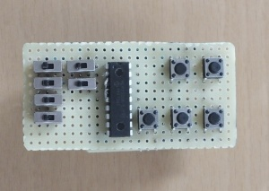
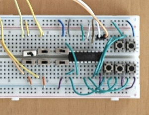
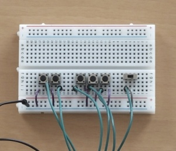
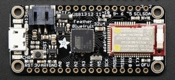
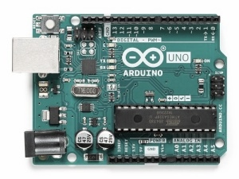
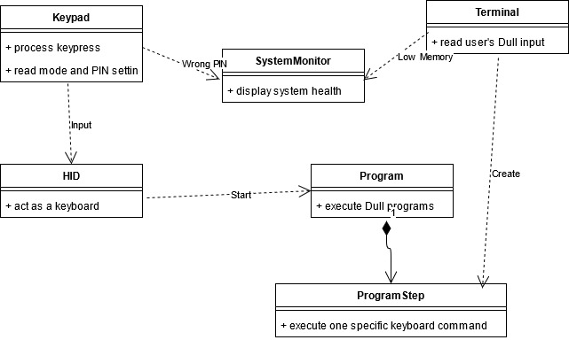
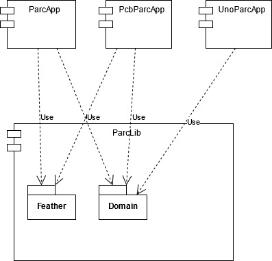
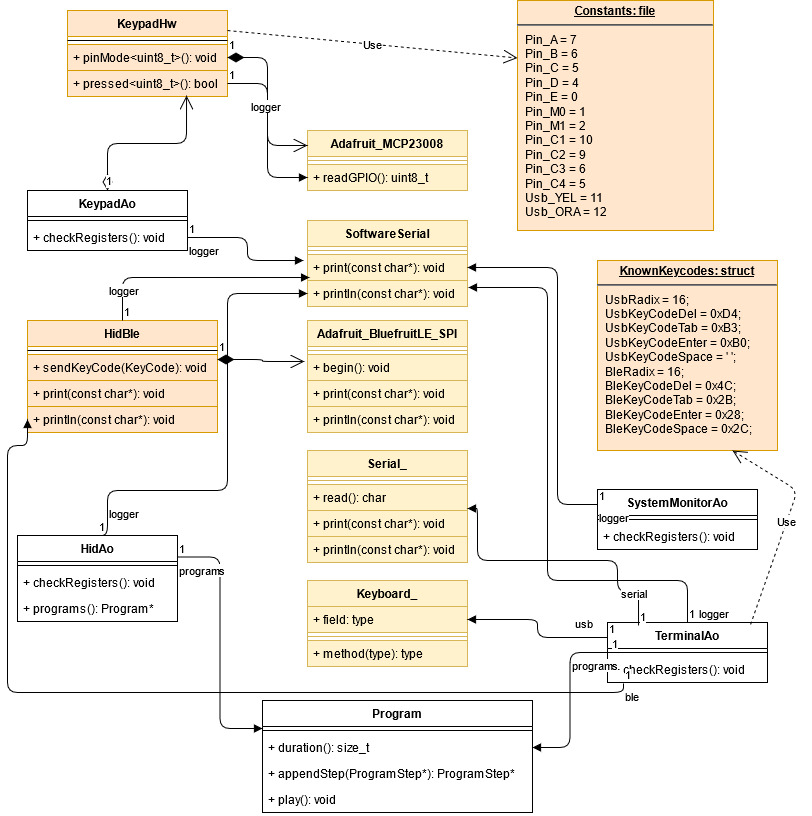

# Parc Software Design

## Concepts

The software architecture is a typical domain centric architecture. The the same domain model is used on different hardware platforms,  the ports-and-adapters architecture is ideal for this.

The hardware components are a keypad and a CPU board. The functionally for a Parc device is given by the domain model, the hardware can change and may supports only a subset of the functionality.

| USB and BLE | USB Only |
| ----------------------- | -------- |
|     |  |
|  |   |


### Domain Model



### Components



Because the small size of the project, some infrastructure code is in the ParbLib library. Core and infrastructure are the typical names. Here, the names are "Domain" and "Feather". 

Infrastructure code that is not shared between the ParcApp and the PcbParcApp as the keypad hardware implementation is in the ParcApp resp. PcbParcApp component. 

The term "Feather" may not be sufficient in future as a Adafruit Feather M0 Bluefruit LE could be used. 

#### Active Components

- KeypadAo: Polls the input (key presses) on the keypad
- HidAo: Acts as the HID (human interface device) and executes a program of commands (the program steps). Only one program can run at a time.
- TerminalAo: Process the serial input and interprets it as a Dull program.
- SystemMonitorAo: Holds the current system state and shows it to the user.

#### Passive Compentents

- Program: A concrete series of program steps.
- ProgramStep: A abstract definition of a HID command such as a keypress or a BLE command (e.g. Mute).
- Registers: A array of value objects which are modified and read by the active components.

### ParcApp Detail Design

The infrastructure implementations for the ParcApp. The PcbParcApp has a different implementation for the keypad but shared the implementations for the program steps.



All yellow/orange colored classes are infrastructure. Also the ProgramStep implementations, which are not shown on the diagram, are infrastructure.

## Best practices

### Memory optimization

#### Use static polymorphism when possible

Instead of

```C++
class Ao {
public:
  virtual void checkRegisters() = 0;
};

class MemoryMonitorAo : public Ao {
    void checkRegisters() override {}
}
```

use

```C++
template<class TDERIVED>
class Ao {
public:
  void checkRegisters() {
    static_cast<TDERIVED*>(this)->checkRegisters();
  }
};

template<class TLOGGER, uint8_t LOWMEMORY>
class MemoryMonitorAo : public Ao<MemoryMonitorAo<TLOGGER, LOWMEMORY>> {
  void checkRegisters() {}
}
```

Why? Per virtual method and derived class 1 `int` is required in a vtable . This are 20 Bytes on a 16bit platform and 10 derived classes.

#### Avoid const members in a library

Instead of

```C++ 
template<class TLOGGER>
class MemoryMonitorAo : public Ao<MemoryMonitorAo<TLOGGER>> {
private:
  const uint8_t LOWMEMORY = 200;
};
```

use

```C++
const uint8_t LOWMEMORY = 200; // outside of the class, e.g. in Shared.h
```

or static

```C++
template<class TLOGGER>
class MemoryMonitorAo : public Ao<MemoryMonitorAo<TLOGGER>> {
private:
  static const uint8_t LOWMEMORY = 200;
};
```

even better

```C++
template<class TLOGGER, uint8_t LOWMEMORY>
class MemoryMonitorAo : public Ao<MemoryMonitorAo<TLOGGER, LOWMEMORY>> {
};
```

Why? Because then the value is defined in the application. The application can be for different hardware like: ATMel, ARM, Windows, Tests.

BTW, `#define LOWMEMORY 200` instead of the discussed const values does not save memory.

Note: In the parcapp, const members are optimized away.

#### Object vs. Class trade-off

Instead of

```C++
template<class TLOGGER>
class ProgramStep {
public:
  void play();
private:
  uint8_t _tick;
};
```

consider:

```C++
template<class TLOGGER>
class ProgramStep {
public:
  ProgramStep<TLOGGER>* play(uint8_t& tick);
};


```

Why? The signature change increases the memory by 2 integers per class. Given 40 objects and given 10 derived classes: 40 * `uint8_t` == 10 * 2 * `int`.

### Patterns

#### Compile-time switch

Instead of

```C++
template<typename TLOGGER>
class KeypadHw {
public:
  bool pressed(uint8_t hwswitch) {
    switch(hwswitch) {
      case KeyPadSwitch::Btn_A: return false;
      case KeyPadSwitch::Btn_B: return false;
      case KeyPadSwitch::Btn_C: return false;
    }
  }
};
```

use:

```C++
template<typename TLOGGER>
class KeypadHw {
public:
  template<KeyPadSwitch SWITCH>
  bool pressed() { return pressed(Int2Type<SWITCH>()); }
private:
  bool pressed(Int2Type<KeyPadSwitch::Btn_A>) { return false; }
  bool pressed(Int2Type<KeyPadSwitch::Btn_B>) { return false; }
  bool pressed(Int2Type<KeyPadSwitch::Btn_C>) { return false; }
};
```

Why? If the enum `KeyPadSwitch` changes, you are notified at compile time. `SWITCH` does not refer to the switch statement but to a hardware switch (e.g. toggle buttons).


#### Aggregate instead of layering

```C++
template<class TLOGGER, class TKEYPADHW>
class KeypadAo : public Ao<KeypadAo<TLOGGER, TKEYPADHW>> {
public:
  KeypadAo(RegisterData_t* registers, TLOGGER& logger, TKEYPADHW& keypadHw)
    : Ao_t(registers), _log(logger), _hw(keypadHw) {}
  void checkRegisters() {
    if (_hw.template pressed<KeyPadSwitch::Btn_A>()) {}
    else if (_hw.template pressed<KeyPadSwitch::Btn_B>()) {}
    else if (_hw.template pressed<KeyPadSwitch::Btn_C>()) {}
  }
private:
  Hw_t& _hw;
};
```

Why? Any class with the used interface can be used as logger or keypad hardware. Inheritance and by that virtual methods is not required. Great for testing with fake classes.


#### Trust the optimizer

```C++
#include <SoftwareSerial.h>
class FakeLogger {
public:
  FakeLogger(uint8_t a, uint8_t b) {}
  void begin(uint16_t a) {}
  template<typename T>
  void print(T ch) { }
  template<typename T>
  void print(T ch, uint8_t mode) {}
  template<typename T>
  void println(T ch) {}
  template<typename T>
  void println(T ch, uint8_t mode) {}
};
typedef FakeLogger Logger_t; // typedef SoftwareSerial Logger_t
Logger_t logger(Usb_ORA, Usb_YEL);
```

Why? If the logger type is changed for a serial to a fake logger (without base class as you can see), the optimizer will handle it:

Free Memory: 1403

Free Memory: 1519

If inheritance was used, i guess this would not be possible.


#### Use a typelist as factory

```C++
struct ProgramStepFake : public ProgramStep<Logger_t> {
  ProgramStepFake(Logger_t& logger, HidUsb_t& ble, KeyCode keyCode, uint8_t repetitions) : ProgramStep(logger, 0) {}
  ProgramStepFake(Logger_t& logger, HidUsb_t& usb, const char* text) : ProgramStep<Logger_t>(logger, 0) {}
  ProgramStepFake(Logger_t& logger, HidBle_t& ble, const char* text) : ProgramStep<Logger_t>(logger, 0) {}
  ProgramStepFake(Logger_t& logger, HidBle_t& ble, KeyCode keyCode) : ProgramStep(logger, 0) {}
  ProgramStepFake(Logger_t& logger, HidBle_t& ble, KeyCode keyCode, uint8_t repetitions) : ProgramStep(logger, 0) {}
  ProgramStepFake(Logger_t& logger, HidBle_t& ble, const char* ctrlKey, uint16_t duration) : ProgramStep(logger, duration) {}
  void action(VirtualAction type, uint8_t& tick) override {};
};

typedef Typelist<ProgramStepWait<Logger_t>,
  Typelist<ProgramStepUsbKeyboardCode<Logger_t, HidUsb_t>,
  Typelist<ProgramStepFake,
  Typelist<ProgramStepFake,
  Typelist<ProgramStepFake,
  Typelist<ProgramStepFake,
  Typelist<ProgramStepFake,
  Typelist<ProgramStepFake,
  NullType>>>>>>>> ProgramStepList;
```

Why? in the Arduino project, only for "Wait" and "USB Keycode" a program step is implemented, the factory requires one a fake for the rest.

Note: action has to be implemented and a run-time exception would be required to ensure it is never called. In my example, if a Dull program uses "BK" on an Uno, it is just ignored.


#### Command pattern

```C++
template<uint8_t CMDTYPE>
struct CmdComparator {
  bool operator()(const char* another) const {
    return equals(another);
  }
  bool equals(const char* another) const { return false; }
  bool operator()(char** another) const {
    return equals(another);
  }
  bool equals(char** another) const { return false; }
};

```

```C++
if (CmdComparator<PsType::Wait>()(subStrs[0])) {
  progStep = createProgramStepWait(subStrs[1]);
}
else if (CmdComparator<PsType::BleKeycode>()(subStrs[0])) {
  progStep = createProgramStepBleKeyboardCode(subStrs, numSubStr);
}
else if (CmdComparator<PsType::UsbKeycode>()(subStrs[0])) {
  progStep = createProgramStepUsbKeyboardCode(subStrs, numSubStr);
}
```

```C++
template<> bool CmdComparator<PsType::Wait>::equals(const char* another) const 
{ return 'W' == another[0]; }
template<> bool CmdComparator<PsType::UsbKeycode>::equals(const char* another) const 
{ return 'U' == another[0] && 'K' == another[1]; }
```

Why? Very simple, very efficient. Declared and used in the library, defined in the application. In the example, the Arduino Uno project only supports "Wait" and "USB Keycode".


#### Reduce number of virtual methods

Instead of

```C++
template<class TLOGGER>
class ProgramStep {
public:
  void dispose() { /*...*/ doDispose(); }
  ProgramStep<TLOGGER>* play(uint8_t& tick) { /*...*/ doPlay(tick); 
protected:
  virtual void doDispose() = 0;
  virtual void doPlay(uint8_t& tick) = 0;
};
```

use

```C++
enum class VirtualAction {
  Dispose,
  Tick
};
template<class TLOGGER>
class ProgramStep {
public:
  void dispose() { /*...*/ action(VirtualAction::Dispose, _duration); }
  ProgramStep<TLOGGER>* play(uint8_t& tick) { /*...*/ action(VirtualAction::Tick, tick); }
protected:
  virtual void action(VirtualAction type, uint8_t& tick) = 0;
};
```

Why? Every virtual method has a pointer (two bytes) in the virtual table, i.e. per class. Given 10 derived classes:

- virtual void doDispose() = 0;
  virtual void doPlay(uint8_t& tick) = 0;
   => 2 * 2 bytes for the vtable + 2 bytes for the `&tick` => 6 bytes per class => 10 * 6 = 60 bytes

- virtual void action(VirtualAction type, uint8_t& tick) = 0;

   => 2 bytes for the vtable + 1 byte for `type` + 2 bytes for `&tick` => 5 bytes per class => 10 * 5 = 50 bytes


<a rel="license" href="http://creativecommons.org/licenses/by-sa/4.0/"></a><br />This work is licensed under a <a rel="license" href="http://creativecommons.org/licenses/by-sa/4.0/">Creative Commons Attribution-ShareAlike 4.0 International License</a>.