# Programmable Arduino Remote Control (PCB)

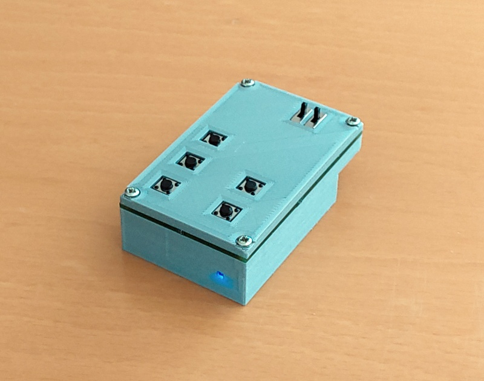

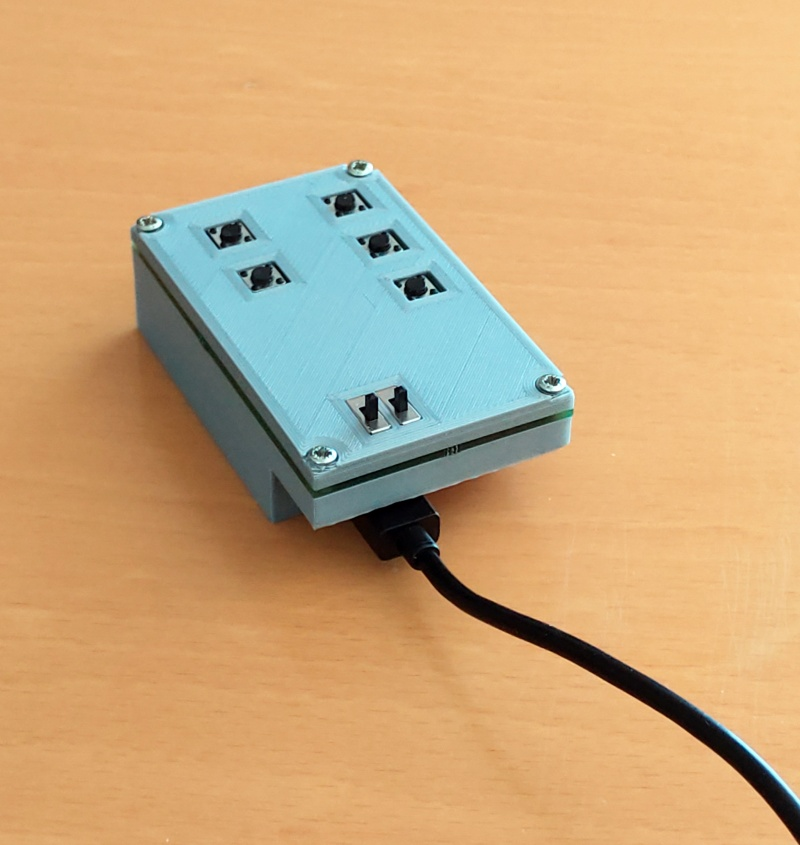

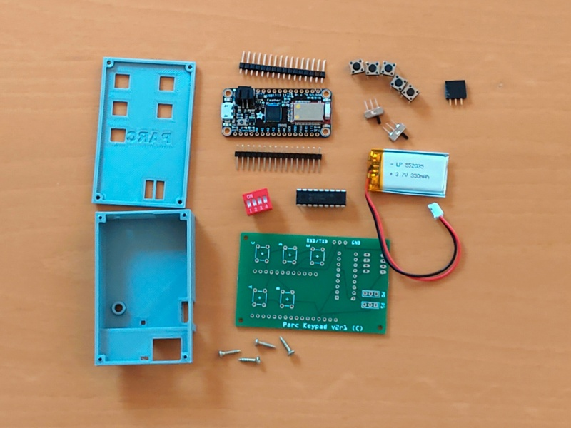

With this small, palm-sized device, it is possible to remote control your PC or your Smartphone. Or to control your PC and your Smartphone at the same time.

And it is freely programmable. You can write programs like: Login to  your PC, open and login to instructables.com, play/pause a movie or  adjust the volume on your Smartphone.


How is that possible? The used micro controller board has a chip that can act as a so called HID device, which stands for Human Interaction Device and simply means keyboard or mouse. And it has another chip, a Bluetooth chip which can act as a Bluetooth keyboard.


The programming is intuitive and there are more examples in the User Manual in the Wiki [1]. The syntax is described in the Programming Guide [1]. The video demonstrates a wireless login to a Windows PC with one click and a login to instructables.com with another click.

https://youtu.be/EJmvuccJp7M


What makes this remote control unique is that everything is stored in the volatile memory of the micro controller. It is safe to write programs which contain passwords.

And it is unique as Bluetooth remote control which you can program from a long list of possible commands. For more details see also the User Manual [1].


This is a improved version of the [Programmable Arduino Remote Control](https://www.instructables.com/Programmable-Arduino-Remote-Control/). It uses a printed circuit board (PCB) which you have to have manufactured. This costs a little extra. In return, the shape is more that of a remote control and it requires less soldering.

In this project, my goal  was to make a device that looks more like a remote control. Further, and because I use it every day, I wanted something more robust than its predecessor.


The direct material costs are approximately USD 78.


[1] [Parc Wiki on github](https://github.com/mrstefangrimm/Parc/wiki)


### Supplies:

1 Adafruit Feather 32u4 Ble ([at adafruit.com](https://www.adafruit.com/product/2829))

1 MicroUSB cable

1 Custom PCB (see step Printed Circuit Board)

1 IC MCP23008 (https://www.adafruit.com/product/593)

1 LiPo 350 mAh (https://www.adafruit.com/product/2750)

5 Button switch, 6mm (https://www.adafruit.com/product/1119)

2 Slide switch (https://www.adafruit.com/product/805)

1 Stack female headers (https://www.adafruit.com/product/2886)

1 DIP switch 4 positions ([at mouser](https://www.mouser.com/ProductDetail/E-Switch/KAS1104ET?qs=f57gQzlyLioBdQLVanmY3g%3D%3D))

4 Screw M2 x l10

1 Windows PC

1 Arduino IDE (https://www.arduino.cc/en/software). Optional: PuTTY (https://www.putty.org)

1 3D Printer

1 Soldering iron and soldering wire

21g PLA filament


I added links to the Adafruit and the Mouser web shops, but you also get the parts elsewhere. For example for the LiPo battery, search for "PKCELL LP552035".


## Step 1: 3D printed parts

PLA and the standard settings (20% infill) can be used. Support structures have to be enabled.

- PcbParc-Case.stl

- PcbParc-Top.stl


## Step 2: Printed Circuit Board


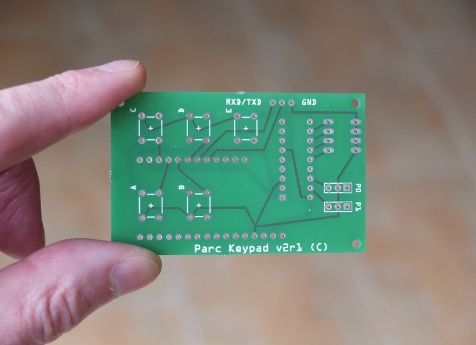


I had mine produced by Aisler (https://aisler.net/). At Aisler, it is possible to produce the PCB directly from the attached Fritzing project file.

If the manufacturer of your choice does not support Fritzing as import format, then try the [Gerber files](https://github.com/mrstefangrimm/Parc/blob/main/Instructable/Keypad-v2-Gerber.zip). "All" manufacturer support Gerbers.


## Step 3: Soldering keypad

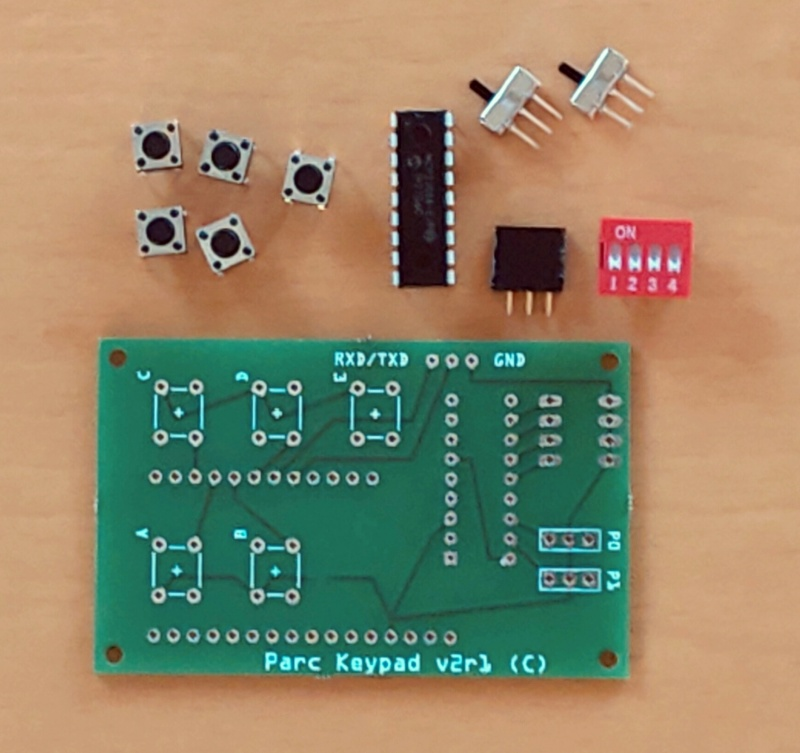

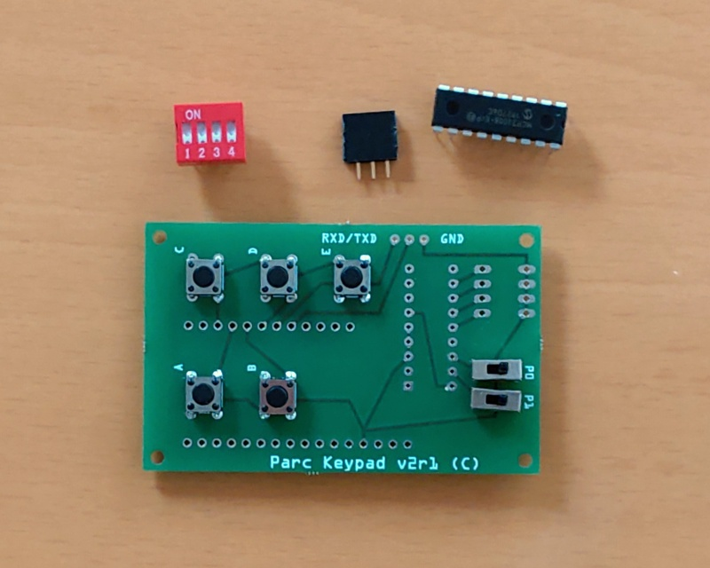

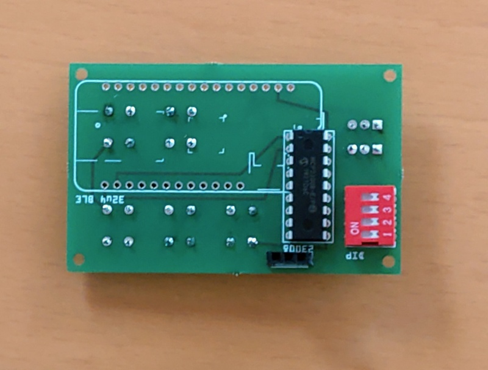


Solder the five push buttons and the two slide switches to the front side of the PCB. Turn the PCB and add the MCP23008. Make sure the direction of the IC is correct.

Add the DIP switch.

From a female header stack, break out a piece of three pin sockets. Solder this piece to the back side of the PCB. 


## Step 4: Soldering micro controller

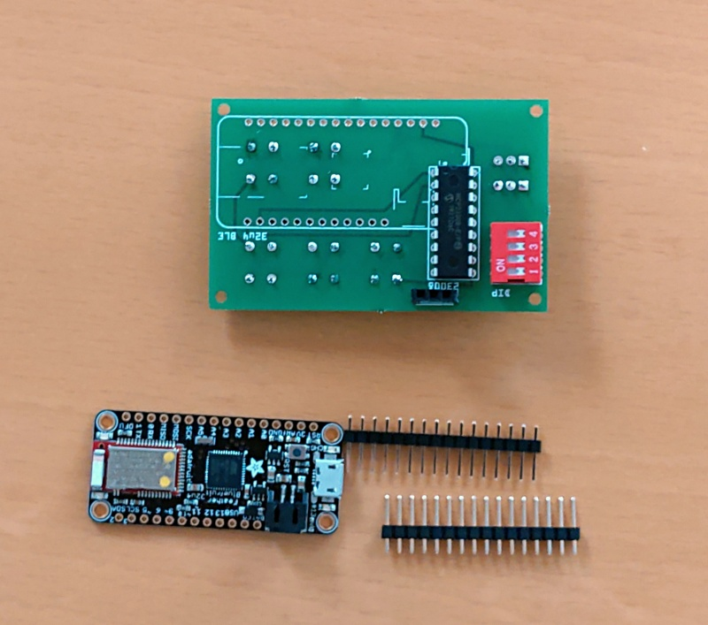

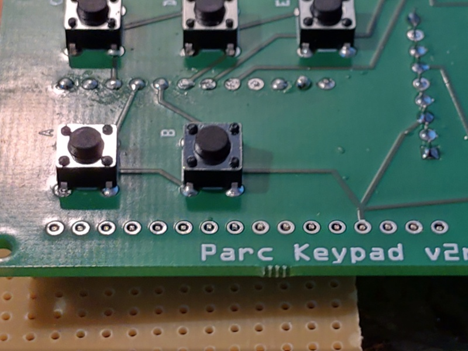

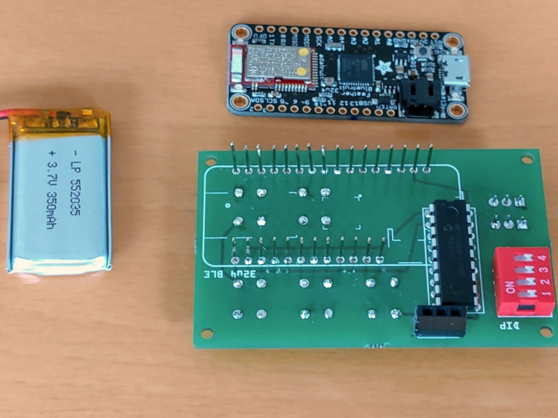

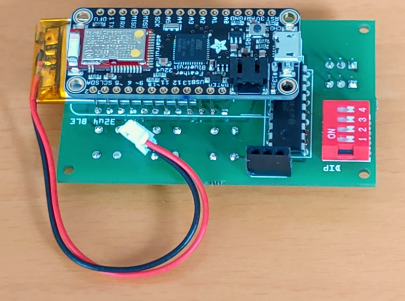

Solder the header pins to the back side of the keypad. You can also solder the pins first to the micro controller board and as the second solder it to the keypad.

Solder the pins flush to the keypad. The plastic distance holder that holds the pins as an array is by default set that the pins look out 1 mm. So you have to push the pins 1 mm down first.

After the pins are soldered to the keypad, remove the black distance holder band. The battery will required all the space in between the two components.

Lastly, add the micro controller board. The battery shall be free movable between the two components.


## Step 5: Assemble


Connect the battery to the micro controller board. Now you can put whole assembly into the case and use it.

That was it basically. Next you will learn how to install the software and program the remote control.


## Step 6: Arduino IDE, libraries and boards

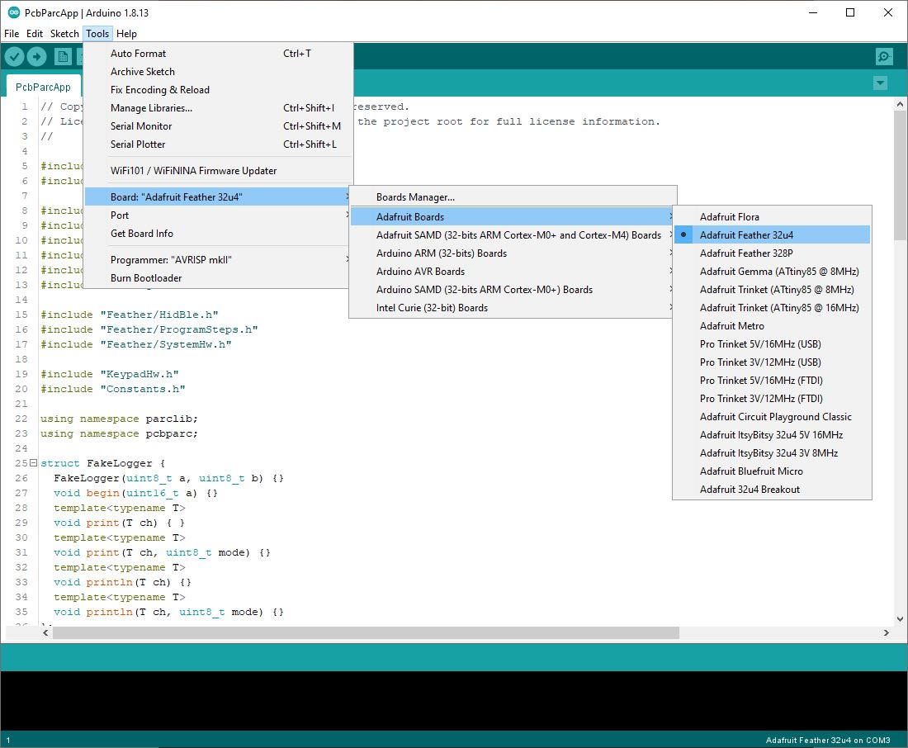


For the following steps, the [Arduino IDE](https://www.arduino.cc/en/software) is required. Download and install the IDE.


Follow the steps from Adafruit and install the "Adafruit AVR Boards" board package. Adafruit has always great, [step-by-step instructions](https://learn.adafruit.com/adafruit-feather-32u4-bluefruit-le/setup).

Download the [library for the MCP23008](https://github.com/adafruit/Adafruit-MCP23008-library) and unzip it into the folder Documents\Arduino\libraries.


Download the libraries [ParcLib.zip](https://github.com/mrstefangrimm/Parc/blob/main/Instructable/ParcLib.zip) and [ParcApp.zip](https://github.com/mrstefangrimm/Parc/blob/main/Instructable/ParcApp.zip). Unzip ParcLib into the folder Documents\Arduino\libraries. Unzip ParcApp into your project folder and open the ParcApp.ino in the  Arduino IDE.

Attach the Parc remote control to your PC with the USB cable. In the  IDE, select the board "Adafruit Feather 32u4" and select the COM port with the same label.

If compiling and uploading succeeds, your device is ready for use.


## Step 7: Test software


Open the PcbParcApp.ino in the Arduino IDE. Compile and upload the software.

In the Arduino IDE, open the Serial Monitor. In the input field, type in a question mark ("?") and hit "Send". As you haven't programmed your device yet, all program slots are empty.

Here's your first program. In the input field of the Serial Monitor, type in: "{ 0 B: UK <Win> 'l'; }" and press "Send". The left lower button on the keypad will now lock the Windows screen when pressed.

## Step 8: Program


It is time to code. To give you an idea, I describe some of the programs used in the demo videos linked in the introduction section. For More information, please have a look at the User Manual in the [Wiki](https://github.com/mrstefangrimm/Parc/wiki).


Login Commands:

`{ 1 A: BK <Ctrl> <Alt> <Del>; W 2000; BT password; W 1000; BK <Enter>; }`

- "1 A" defines the key and mode the program is for. "1" is mode 1 which is  set with the slide switch M0. "A" is the upper left button
- "BK <Ctrl> <Alt> <Del>" sends a "Del" keypress with the control keys "Ctrl" and "Alt"
- "W 2000" lets the program wait for 2 seconds. The program waits for the Windows login screen before it writes the password
- "BT password" sends keypresses "p", "a", "s", ... . Note that it assumes a US-English keyboard. If you have keyboard settings for a different keyboard, there is a simple trick: Send "BK <Win> <Space>" as the first program step. This will change the keyboard on the PC.


Remote Control Commands:

```{ 3 A: BC PlayPause; }
{ 3 B: BC MediaNext; }
{ 3 C: BC Volume+; }
{ 3 D: BC Volume-; }
{ 3 E: BC Mute 1000; }
```

- "3 A" defines the program for mode 3 and key "A". Mode 3 is set with the slide switches "M1" and "M0"
- "BC" stands for Bluetooth Controlkey. This sends commands that most Bluetooth connected devices "understand"
- "BC Mute 1000". Sends Mute and waits for 1 second. This seconds hinders the device to interpret you key press as two keypresses
