# Programmable Arduino Remote Control

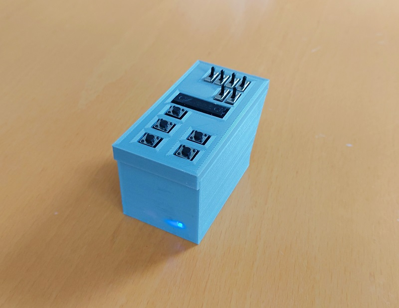

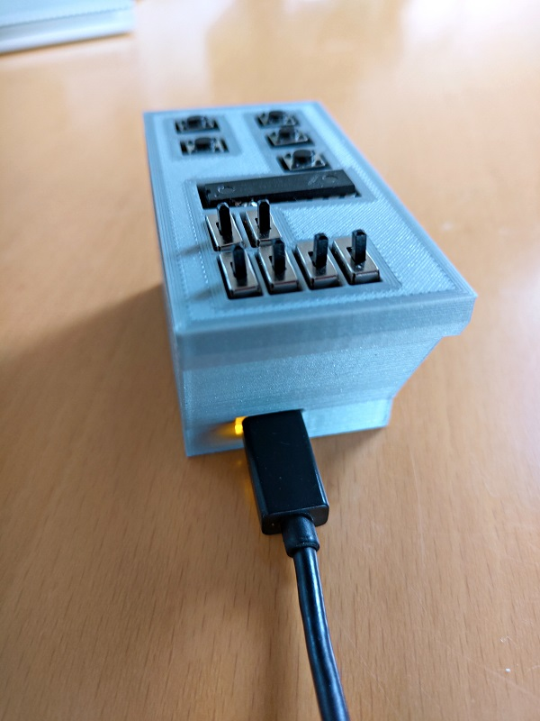

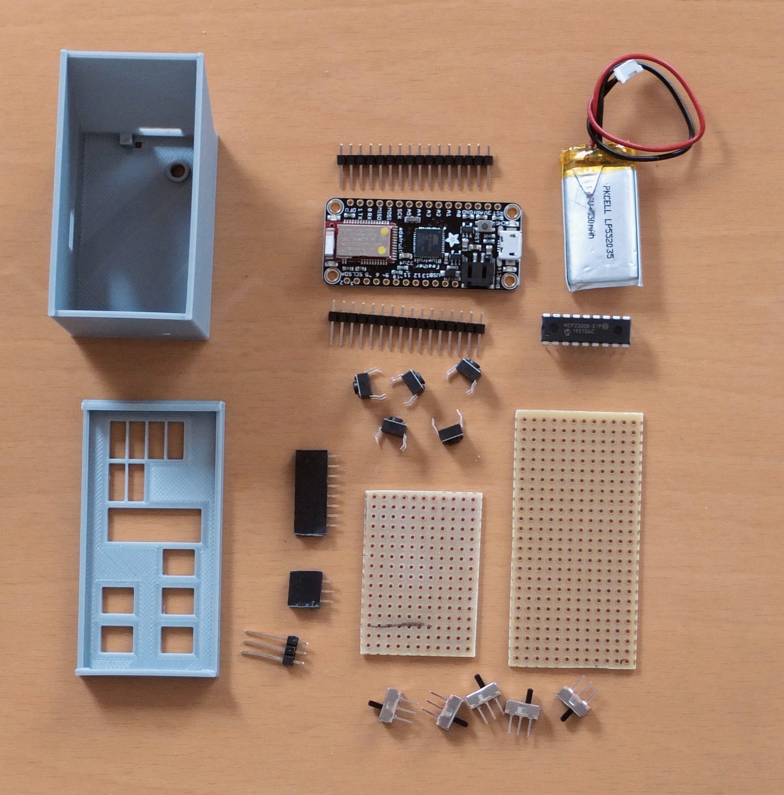

With this small, palm-sized device, it is possible to remote control your PC or your Smartphone. Or to control your PC and your Smartphone at the same time.

And it is freely programmable. You can write programs like: Login to  your PC, open and login to instructables.com, play/pause a movie or  adjust the volume on your Smartphone.


How is that possible? The used micro controller board has a chip that can act as a so called HID device, which stands for Human Interaction Device and simply means keyboard or mouse. And it has another chip, a Bluetooth chip which can act as a Bluetooth keyboard.


The programming is intuitive and there are more examples in the User Manual in the Wiki [1]. The syntax is described in the Programming Guide [1]. The video demonstrates a wireless login to a Windows PC with one click and a login to instructables.com with another click.

[Login Demo](https://youtu.be/DcMdJxYA3Bc)


In the second video, the Parc device is used as a Bluetooth remote control with the functions: Volume Up and Down, Next Song, Mute. Further, the remote control is connected to the PC and sends keyboard commands that open a text editor and type in some text.

[Dual Use Demo](https://youtu.be/E0nmfwVdOjc)


What makes the Parc remote control unique is that everything is stored in the volatile memory of the micro controller. It is safe to write programs which contain passwords.

And it is unique as Bluetooth remote control which you can program from a long list of possible commands. For more details see also the User Manual [1].


The idea for the Parc remote control came when I read and made this great instructable:

https://www.instructables.com/How-to-Make-a-Arduino-HID-Keyboard

It describes how you can turn an Arduino UNO into a USB keyboard. The Arduino UNO is limited in the way that the firmware on the serial interface chip has to be changed. But read yourself.


From the first prototype with hardcoded programs to the current version, I use the Parc remote control almost every day. At work it is handy to login, lock the screen or login to the time management tool. At home I often use it as remote control when I watch a movie on my PC.


The direct material costs are approximately USD 70.


[1] Parc Wiki: https://github.com/mrstefangrimm/Parc/wiki


### Supplies:

1 Adafruit Feather 32u4 Ble (https://www.adafruit.com/product/2829)

1 MicroUSB cable

1 IC MCP23008 (https://www.adafruit.com/product/593)

1 LiPo 350 mAh (https://www.adafruit.com/product/2750)

5 Button switch, 6mm (https://www.adafruit.com/product/1119)

6 Slide switch (https://www.adafruit.com/product/805)

1 Prototyping board, cut into 2 pieces, 32x65mm and 32x42mm  (https://www.adafruit.com/product/2670)

1 Stack female headers (https://www.adafruit.com/product/2886)

1 Long male header pins (https://www.adafruit.com/product/400) 

1 Windows PC

1 Arduino IDE (https://www.arduino.cc/en/software). Optional: PuTTY (https://www.putty.org)

1 3D Printer

1 Soldering iron and soldering wire, hookup wire

21g PLA filament

1 Metal saw (to cut the prototyping board)


I added links to the Adafruit webshop, but you also get the parts elsewhere. For the LiPo battery, search for "PKCELL LP552035".


## Step 1: 3D printed parts

PLA and the standard settings (20% infill) can be used. Enable support structures for the openings for the USB plug.

- Parc-Case.stl

- Parc-Top.stl


## Step 2: Prototype on breadboard

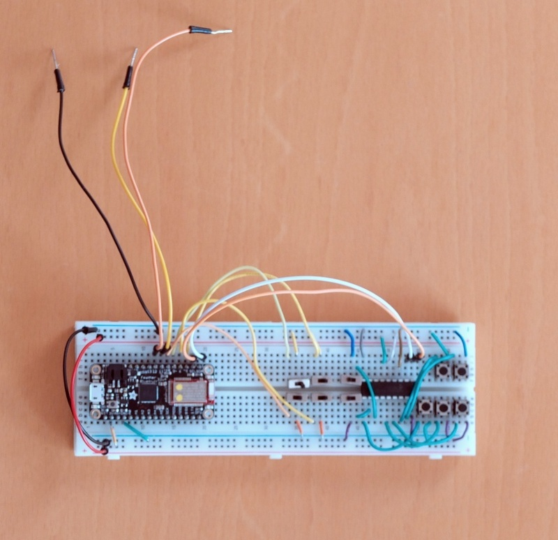

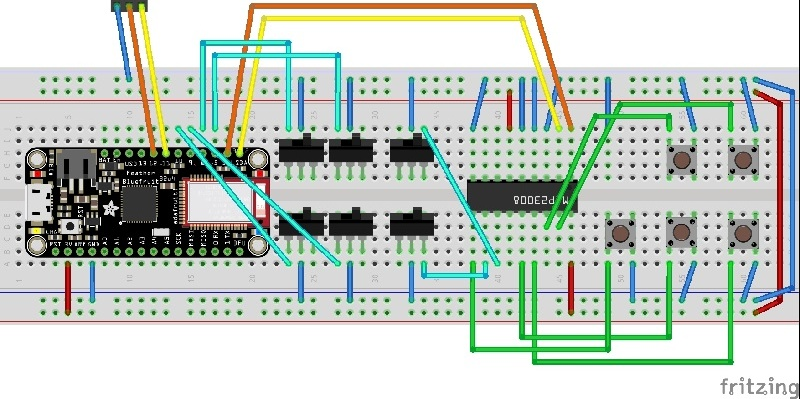

Once you have all the parts, I recommend to test the parts on the breadboard before you start building the remote control. The wiring on the pictures is the same as for the final product. 

I recommend to install the test program first and check that the wiring is correct and the component work. Steps 6 and 7 describes how this is done.

If you like, you can attach the battery, install the final software and  use breadboard as remote control. If are not planning to actually build the  device, continue with step 6.


## Step 3: Soldering keypad

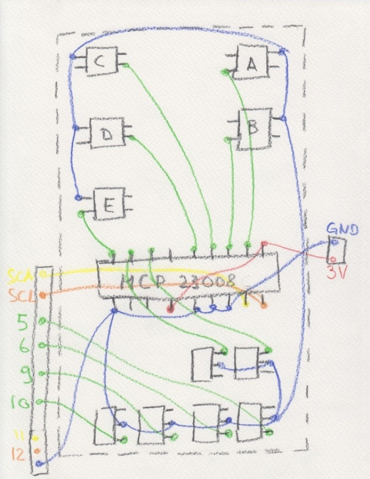

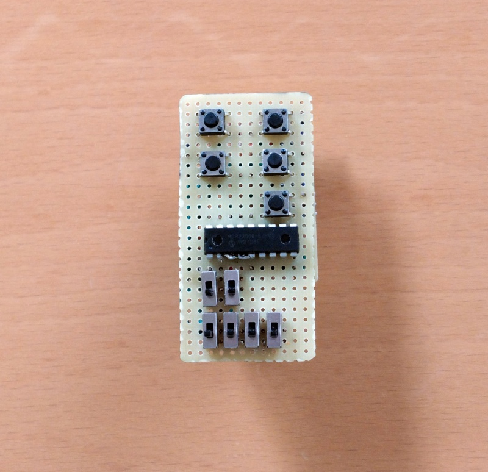

This will be the most time consuming part. Take your time. The prototyping board has the dimension 32x65mm, or 25x12 holes.

The hand painted soldering plan should help you through the process. Leave the length of the wires that are lead out approximately 40mm long. These wires are soldered to the connection board in the next step. The wires are labeled: 3V, GND, SDA, SCL, 5, 6, 8, 10.

Add the switches and the MCP23008 first and then start with the wires for the power (red on the painting). Then add the wires for the ground (blue) and then the green wires. 

## Step 4: Soldering connection board

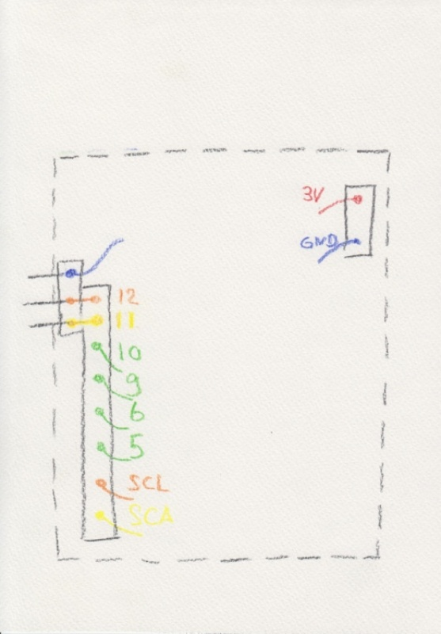

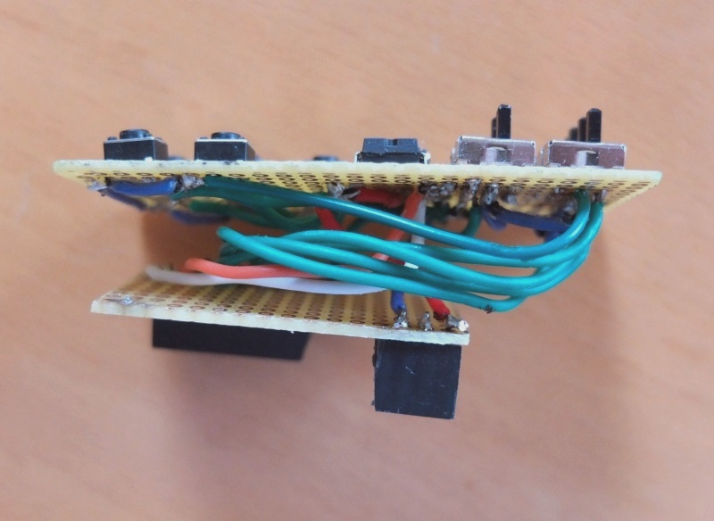

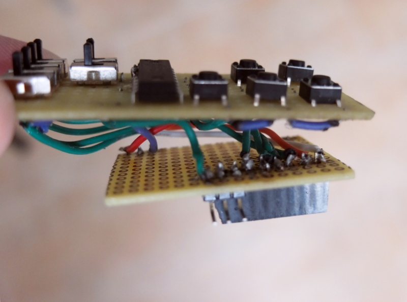

The connection board's size is 32x42mm, or 16x12 holes. 

Add (solder) the stack headers to the board first. One has 8 pin sockets and one has 3 pin sockets. 

Add an array of 3 long male pins to the connection board. First you bend the pins in a 90 degree angle. The center and the right pin (see photo) are connected to the two most left stack header pins. 

Cut the lead out wires of the keypad board to the right length. The distance between the keypad and the connection board should be approximately 12mm. Hold the boards together and bend the wires into the correct form.

## Step 5: Assemble

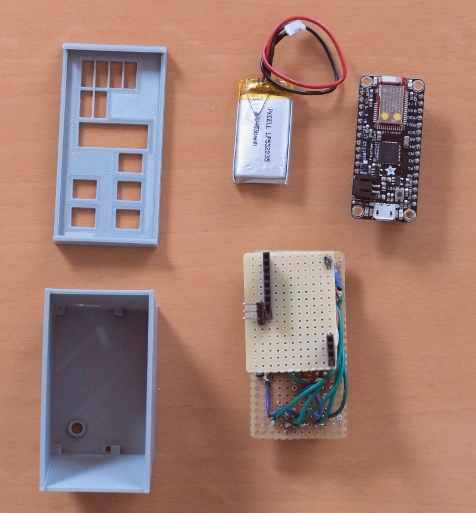

You're almost through. Plug-in the micro controller board into the stack headers of the connection board. The 3V3 and the GND pin of the micro controller board go into the 3-holes stack header. The pins SDA to 12 of the micro controller board go into the other stack header.

The battery is stashed between the micro controller and the connection board. Now you can put it into the case and use it.

## Step 6: Arduino IDE, libraries and boards

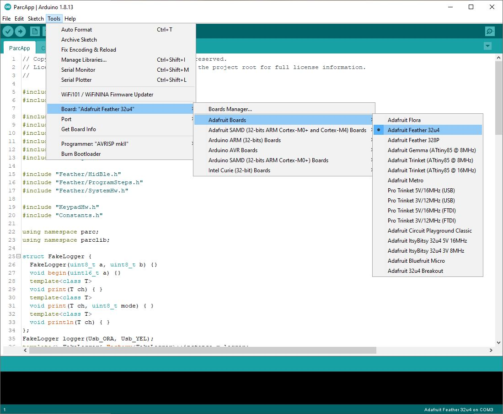


For the following steps, the [Arduino IDE](https://www.arduino.cc/en/software) is required. Download and install the IDE.


Follow the steps from Adafruit and install the "Adafruit AVR Boards" board package. Adafruit has always great, [step-by-step instructions](https://learn.adafruit.com/adafruit-feather-32u4-bluefruit-le/setup).

Download the [library for the MCP23008](https://github.com/adafruit/Adafruit-MCP23008-library) and unzip it into the folder Documents\Arduino\libraries.


Download the libraries [ParcLib.zip](https://github.com/mrstefangrimm/Parc/blob/main/Instructable/ParcLib.zip) and [ParcApp.zip](https://github.com/mrstefangrimm/Parc/blob/main/Instructable/ParcApp.zip) from github. Unzip ParcLib into the folder Documents\Arduino\libraries. Unzip ParcApp into your project folder and open the ParcApp.ino in the  Arduino IDE.

Attach the Parc remote control to your PC with the USB cable. In the  IDE, select the board "Adafruit Feather 32u4" and select the COM port with the same label.

If compiling and uploading succeeds, your device is ready for use.


## Step 7: Hardware test

[Test](https://youtu.be/5a9cY7EyVzM)

It is time to test your work. Download the KeypadTest.ino and open it the Arduino IDE. Compile and upload it.


In the Arduino IDE, open the Serial Monitor. If you press one of the push buttons or use one of the slide switches on the keypad you should see it on the Serial Monitor.


## Step 8: Software test

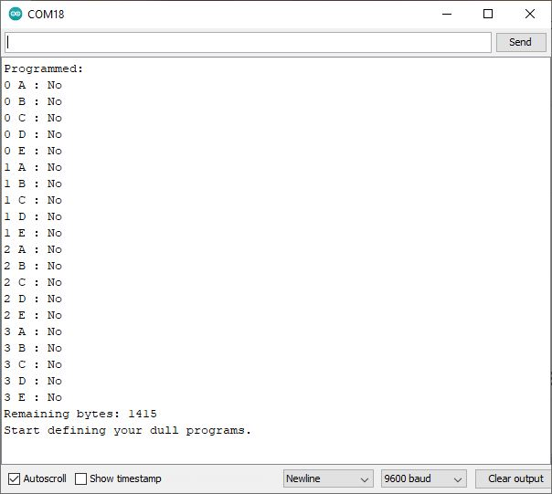

Open the ParcApp.ino in the Arduino IDE. Compile and upload it.

In the Arduino IDE, open the Serial Monitor. In the input field, type in a question mark ("?") and hit "Send". As you haven't programmed your device yet, all program slots are empty.

Here's your first program. In the input field of the Serial Monitor, type in: "{ 0 B: UK <Win> 'l'; }" and press "Send". The left lower button on the keypad will lock the Windows screen.

## Step 9: Program

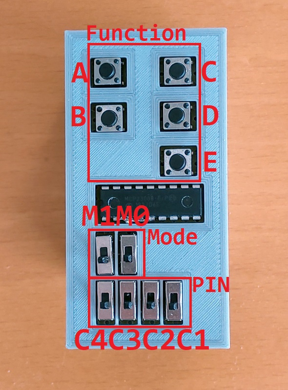

It is time to code. To give you an idea, I describe some of the programs used in the demo videos linked in the introduction section. For More information, please have a look at the User Manual in the [Wiki](https://github.com/mrstefangrimm/Parc/wiki).


Login Commands:

`{ 1 A: BK <Ctrl> <Alt> <Del>; W 2000; BT password; W 1000; BK <Enter>; }`

- "1 A" defines the key and mode the program is for. "1" is mode 1 which is  set with the slide switch M0. "A" is the upper left button
- `BK <Ctrl> <Alt> <Del>` sends a "Del" keypress with the control keys "Ctrl" and "Alt"
- "W 2000" lets the program wait for 2 seconds. The program waits for the Windows login screen before it writes the password
- "BT password" sends keypresses "p", "a", "s", ... . Note that it assumes a US-English keyboard. If you have keyboard settings for a different keyboard, there is a simple trick: Send `BK <Win> <Space>` as the first program step. This will change the keyboard on the PC.


Remote Control Commands:

```{ 3 A: BC PlayPause; }
{ 3 B: BC MediaNext; }
{ 3 C: BC Volume+; }
{ 3 D: BC Volume-; }
{ 3 E: BC Mute 1000; }
```

- "3 A" defines the program for mode 3 and key "A". Mode 3 is set with the slide switches "M1" and "M0"
- "BC" stands for Bluetooth Controlkey. This sends commands that most Bluetooth connected devices "understand"
- "BC Mute 1000". Sends Mute and waits for 1 second. This seconds hinders the device to interpret you key press as two keypresses

